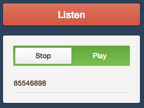
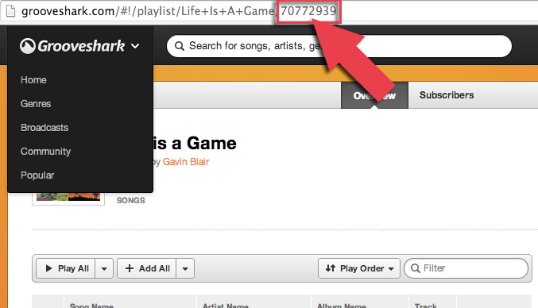

Grooveshark Machine
===================

Grooveshark Machine lets you control a (possibly headless) device to play a Grooveshark Playlist, from another device such as a phone.

Requirements
---

Controller: Any web-enabled device. A phone works great.

Machine: A web-enabled device with a browser, flash and speakers. An old laptop can work, or a Raspberry Pi.


Setup
---

* Clone the repository to your server. Open up permissions for `id.txt`

	```
	$ cd /path/to/grooveshark-machine
	$ chmod 777 id.txt
	```

* Point your Machine to `http://your-server/machine.php`. You may now disconnect any display devices, and turn up the speakers.

* On your Controller device, visit `http://your-server/index.php`



* You may put in a Grooveshark Playlist ID and press `Play` to start playing. `Stop` stops the play.

Grooveshark Playlist ID???
---
The Playlist ID is in the URL when you view a playlist (even on mobile).

